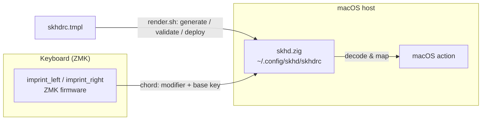
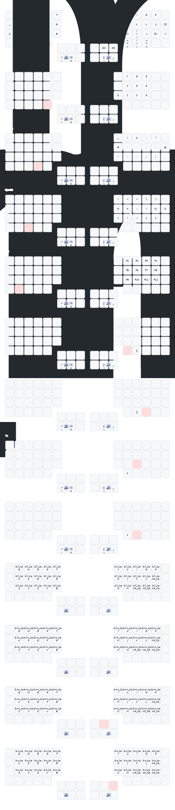

# capsule-corp

[日本語](README.md) | **English**

Monorepo for input-device configuration.

- **Cyboard Imprint** — ZMK firmware config (repo root = ZMK user-config).
  A split keyboard; ZMK emits modifier-combination chords.
- **skhd.zig** — macOS host-side bridge ([`host/skhd/`](host/skhd/)). Chords
  sent by ZMK are received by [skhd.zig](https://github.com/jackielii/skhd.zig)
  and translated into macOS actions.

ZMK sends a chord of a modifier key + a base key; skhd on the host decodes it.
The modifiers are assigned with super / hyper / meta in mind.
[`host/skhd/render.sh`](host/skhd/render.sh) bridges the two by generating,
validating and deploying `skhdrc` from a template.



## Setup

After cloning, enable the commit-message hook (enforces gitmoji +
Conventional Commits / [docs/commit-convention.md](docs/commit-convention.md)):

```sh
git config core.hooksPath scripts/hooks
```

## Layout

```
config/         ZMK keymap / behaviors / combos / west.yml (must stay at root)
build.yaml      Build targets (assimilator-bt × imprint_left / imprint_right)
boards/ zephyr/  ZMK board-root (board/shield come from the Cyboard module; empty is normal)
keymap-drawer/  keymap SVG (auto-generated & committed by the draw-keymap CI)
host/skhd/      macOS skhd bridge (render.sh, skhdrc.tmpl)
scripts/        build-local.sh (Docker build), gen_eiji_drawer_map.py, hooks/
docs/           commit convention, etc.
.github/        CI (build / draw / verify-eiji-sync / commit-lint / shellcheck / release)
```

Per ZMK/upstream constraints, `config/`, `boards/`, `zephyr/module.yml` and
`build.yaml` must remain at the repo root (do not move). See [CLAUDE.md](CLAUDE.md).

## ZMK firmware build

After editing `config/imprint.keymap` etc., get the `.uf2` via one of the
following. Build targets are in [build.yaml](build.yaml) (`assimilator-bt` ×
`imprint_left` / `imprint_right`). ZMK itself tracks `main` (required by the
Cyboard module; pinning is not possible — see [CLAUDE.md](CLAUDE.md)).

### GitHub Actions (no local setup)

1. Push the change (or open a PR)
2. GitHub **Actions** tab → open the `Build` run
3. Download `firmware` from the run's **Artifacts** and unzip
4. Flash the `imprint_left` / `imprint_right` `.uf2` to each half

### Local (Docker)

```sh
./scripts/build-local.sh                 # all targets in build.yaml
./scripts/build-local.sh imprint_left    # a specific shield
./scripts/build-local.sh --update        # refresh deps (west update)
./scripts/build-local.sh --clean         # drop the cached workspace
```

- Output: **`firmware/imprint_left.uf2`** / **`firmware/imprint_right.uf2`**
  (git-ignored)
- Requires Docker. Deps persist in `~/.cache/zmk-capsule-corp` (fast after the
  first run)

### Release

Run the **Release** workflow manually → the next version is computed from
commits; it creates a tag, `CHANGELOG.md`, and a GitHub Release with
`imprint_*.uf2` attached ([docs/commit-convention.md](docs/commit-convention.md)).

## skhd

```sh
host/skhd/render.sh   # generate → validate → deploy to ~/.config/skhd/skhdrc & reload
```

Location-independent. A config that fails validation is not deployed, so the
running `skhdrc` is never broken.

## keymap

<details>
<summary>Show keymap diagram</summary>



</details>

The keymap is [`config/imprint.keymap`](config/imprint.keymap) (each `*.dtsi`
is `#include`d). The EIJI (Japanese romaji input) layer is generated by
`scripts/gen_eiji_drawer_map.py` from a single source,
[`config/eiji_macros.dtsi`](config/eiji_macros.dtsi); CI verifies they stay in
sync.

## Development & License

- Commits: **gitmoji + Conventional Commits**
  ([docs/commit-convention.md](docs/commit-convention.md))
- License: [MIT](LICENSE) © 2026 akira-toriyama
