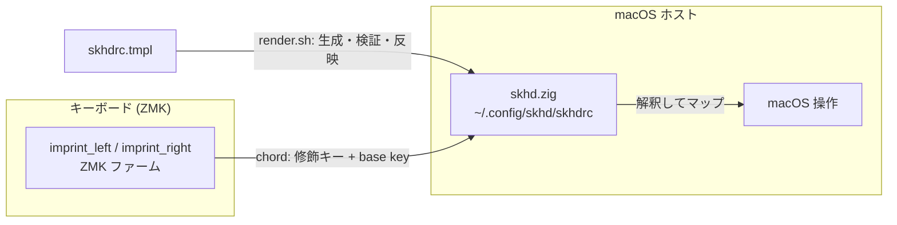

# capsule-corp

**日本語** | [English](README.en.md)

入力デバイス設定の monorepo。

- **Cyboard Imprint** — ZMK ファームウェア設定（リポジトリルート = ZMK
  user-config）。分割キーボード。修飾キーの組み合わせ（chord）を ZMK が送出する。
- **skhd.zig** — macOS ホスト側ブリッジ（[`host/skhd/`](host/skhd/)）。ZMK が
  送る chord を [skhd.zig](https://github.com/jackielii/skhd.zig) で受けて
  macOS 操作へ変換する。

ZMK 側で修飾キー（modifier）＋ base key の chord を送り、host の skhd が
解釈する。修飾キーは super / hyper / meta を意識した割り当て。両者の対応は
[`host/skhd/render.sh`](host/skhd/render.sh) がテンプレートから `skhdrc` を
生成・検証・反映してブリッジする。



## 環境構築

クローン後、コミットメッセージ検証フックを有効化する（gitmoji +
Conventional Commits を強制 / [docs/commit-convention.md](docs/commit-convention.md)）。

```sh
git config core.hooksPath scripts/hooks
```

## ディレクトリ構成

```
config/         ZMK キーマップ / behaviors / combos / west.yml（ルート必須）
build.yaml      ビルド対象（assimilator-bt × imprint_left / imprint_right）
boards/ zephyr/  ZMK board-root（ボード/シールドは Cyboard モジュール由来。空で正常）
keymap-drawer/  keymap 図 SVG（draw-keymap CI が自動生成・コミット）
host/skhd/      macOS skhd ブリッジ（render.sh, skhdrc.tmpl）
scripts/        build-zmk.sh / render-skhd.sh（エントリ）, gen-eiji-drawer-map.py, hooks/
docs/           コミット規約ほか
.github/        CI（build / draw / verify-eiji-sync / commit-lint / shellcheck / release）
```

ZMK と上流ツールの制約で `config/` `boards/` `zephyr/module.yml` `build.yaml`
はリポジトリルート固定（移動しない）。詳細は [CLAUDE.md](CLAUDE.md)。

## ZMK ファーム ビルド

`config/imprint.keymap` 等を変更したら、以下のいずれかで `.uf2` を得る。
ビルド対象は [build.yaml](build.yaml)（`assimilator-bt` × `imprint_left` /
`imprint_right`）。ZMK 本体は `main` 追従（Cyboard モジュールが要求。タグ固定
不可。詳細 [CLAUDE.md](CLAUDE.md)）。

### GitHub Actions（環境構築不要）

1. 変更を push（または PR を作成）
2. GitHub の **Actions** タブ → 対象の `Build` run を開く
3. run 下部の **Artifacts** から `firmware` を DL して解凍
4. 中の `imprint_left` / `imprint_right` の `.uf2` を各ハーフへ書き込む

### ローカル（Docker）

```sh
./scripts/build-zmk.sh                 # build.yaml の全ターゲット
./scripts/build-zmk.sh imprint_left    # シールド指定
./scripts/build-zmk.sh --update        # 依存を最新化（west update）
./scripts/build-zmk.sh --clean         # キャッシュ破棄
```

- 出力先: **`firmware/imprint_left.uf2`** / **`firmware/imprint_right.uf2`**
  （`.gitignore` 済）
- 要 Docker。依存は `~/.cache/zmk-capsule-corp` に永続化（2 回目以降は高速）

### リリース

Actions の **Release** を手動起動 → コミットから次版を算出し、`vX.Y.Z`
タグ＋GitHub Release（git-cliff 生成ノート＋`imprint_*.uf2` 添付）を生成
（[docs/commit-convention.md](docs/commit-convention.md)）。`main` 保護尊重の
ため CHANGELOG は main へ自動 push しない。

## skhd

```sh
./scripts/render-skhd.sh   # skhdrc を生成 → 検証 → ~/.config/skhd/skhdrc へ反映・reload
```

clone 位置に依存しない。検証に失敗した設定は反映せず、稼働中の `skhdrc` を
壊さない。

ショートカット一覧・修飾セット・更新手順は
[host/skhd/README.md](host/skhd/README.md)。

## keymap

<details>
<summary>キーマップ図を表示</summary>


</details>

キーマップは [`config/imprint.keymap`](config/imprint.keymap)（各 `*.dtsi` を
`#include`）。EIJI（英字入力）レイヤーは
[`config/eiji_macros.dtsi`](config/eiji_macros.dtsi) を単一ソースとして
`scripts/gen-eiji-drawer-map.py` が生成し、CI で同期を検証する。

## 開発・ライセンス

- コミット規約: **gitmoji + Conventional Commits**（[docs/commit-convention.md](docs/commit-convention.md)）
- ライセンス: [MIT](LICENSE) © 2026 akira-toriyama
